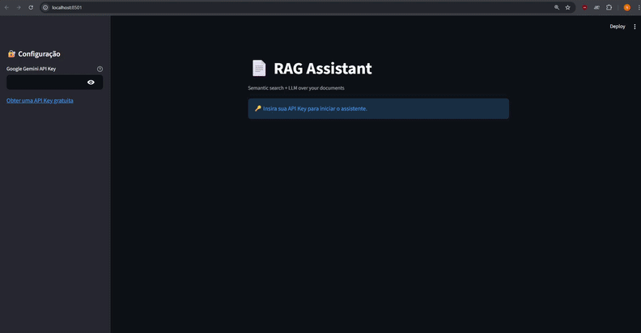

# Intelligent Assistant for Data and Document Analysis

## 📌 Visão Geral

Este projeto implementa um **Assistente Inteligente baseado em RAG (Retrieval-Augmented Generation)** para análise de dados e documentos.
O dataset escolhido para o projeto foi o **GitHub Issues do Kaggle**, e o sistema foi pensado especificamente para utilizá-lo como base de conhecimento para o RAG. 
Ele combina **busca semântica**, **embeddings** e **LLMs (Google Gemini)** para responder perguntas com base em um conjunto de documentos previamente processados.

A aplicação foi desenvolvida em **Python**, utiliza **Streamlit** como interface web e está preparada para **deploy em ambientes cloud (Streamlit Community Cloud)**.

O sistema é capaz de classificar e responder às consultas dos usuários utilizando diferentes escopos de análise:

→ Consultas Qualitativas: Permite a análise de padrões, temas recorrentes e tendências nos problemas, como identificar os principais erros relatados.

→ Consultas Diretas: Busca extrair respostas pontuais e objetivas diretamente do contexto dos dados.

→ Consultas Fora de Contexto (Out of Scope): Identifica automaticamente perguntas que exigem dados numéricos precisos ou fora da base de conhecimento (como "quantos" ou "percentuais"), evitando alucinações e fornecendo uma resposta padrão informando a limitação dos dados.

⚠️ Nota de Otimização: O pipeline funciona de forma estável para os fluxos descritos, porém ainda não está totalmente otimizado ou estável, podendo ocasionalmente cometer erros ou apresentar variações nas respostas.

---

## 🧠 Arquitetura Geral

O sistema segue uma arquitetura modular, separando claramente:

- **UI / Aplicação** (Streamlit)
- **Serviço de RAG** (orquestração)
- **Pipeline de Recuperação** (retriever + validação)
- **Camada LLM** (Gemini)
- **Dados e Embeddings**

Fluxo resumido:

```
Usuário → Streamlit UI → RAGService
        → Retriever (embeddings)
        → Validação de contexto
        → Prompt Builder
        → Gemini LLM
        → Resposta
```

---

## 📂 Estrutura do Projeto

```
Intelligent-Assistant-for-Data-and-Document-Analysis/
│
├── app/
│   ├── __init__.py
│   └── app.py                 # Interface Streamlit
│
├── src/
│   ├── application/
│   │   ├── __init__.py
│   │   └── rag_service.py      # Serviço principal de RAG
│   │
│   ├── rag/
│   │   ├── __init__.py
│   │   ├── pipeline.py         # Orquestração do RAG
│   │   ├── retriever.py        # Busca semântica
│   │   ├── context_builder.py  # Construção de contexto
│   │   └── validator.py        # Validação de contexto
│   │
│   ├── llm/
│   │   ├── __init__.py
│   │   └── gemini_client.py    # Integração com Google Gemini
│   │
│   └── prompts/
│       ├── __init__.py
│       └── rag_prompts.py      # Prompts e classificação de perguntas
│
├── data/
│   └── processed/
│       ├── embeddings.npy     # Embeddings pré-processados
│       └── issue_processed.csv
│
├── notebooks/                 # Exploração e experimentos
├── requirements.txt           # Dependências do projeto
├── README.md
└── LICENSE
```

---

## 🚀 Tecnologias Utilizadas

### Backend / IA
- **Python 3.11**
- **Sentence-Transformers** (MiniLM multilingual)
- **NumPy / Pandas**
- **Scikit-learn**
- **Google Gemini (google-genai)**

### Frontend
- **Streamlit**

### Infra / Deploy
- **Streamlit Community Cloud**
- **GitHub**

---

## 🔍 RAG (Retrieval-Augmented Generation)

O RAG funciona em múltiplas etapas:

1. **Embedding do Dataset** (offline)
2. **Busca Semântica** com similaridade vetorial
3. **Seleção dos documentos mais relevantes** (`top_k`)
4. **Validação de contexto** (evita alucinações)
5. **Construção dinâmica do prompt**
6. **Geração da resposta via LLM**

### Parâmetros principais

```python
RAGService(
    top_k=30,
    similarity_threshold=0.30,
    max_context_chars=800,
    max_documents=6
)
```

---

## 🧩 Serviço Principal (`RAGService`)

O `RAGService` é responsável por:

- Receber a pergunta do usuário
- Executar o pipeline de recuperação
- Garantir que há contexto suficiente
- Delegar a geração de resposta ao LLM

Ele atua como **fachada** entre a UI e o pipeline interno.

---

## 🤖 Integração com Google Gemini

A integração é feita via `google-genai`.

- A **API Key não é armazenada**
- O usuário fornece a chave via interface Streamlit
- A configuração ocorre **uma única vez por sessão**

```python
configure_gemini(api_key)
```

---

## 🖥 Interface (Streamlit)

Funcionalidades da UI:

- Input seguro da API Key
- Chat interativo
- Histórico de mensagens por sessão
- Feedback visual (spinner de processamento)

---

## 📊 Dados e Embeddings

Os dados são:

- **Baixados e processados previamente** (offline)
- Armazenados em `data/processed/`
- Carregados em tempo de execução no deploy

⚠️ O processamento pesado **não ocorre no deploy**, garantindo:
- Inicialização rápida
- Menor custo computacional

---

## 📦 Instalação Local

### 1️⃣ Clone o repositório

```bash
git clone https://github.com/seu-usuario/intelligent-assistant-for-data-and-document-analysis.git
cd intelligent-assistant-for-data-and-document-analysis
```

### 2️⃣ Crie um ambiente virtual

```bash
python -m venv venv
source venv/bin/activate  # Linux/Mac
venv\Scripts\activate     # Windows
```

### 3️⃣ Instale as dependências

```bash
pip install -r requirements.txt
```

### 4️⃣ Execute a aplicação

```bash
streamlit run app/app.py
```

---

## ☁️ Deploy (Streamlit Cloud)

Requisitos:

- `requirements.txt` configurado
- Python 3.11
- Caminho principal: `app/app.py`

Nenhuma variável secreta é obrigatória, pois a API Key é fornecida via UI.

---

## 🔐 Segurança

- API Key do Gemini **não é persistida**
- Uso restrito à sessão atual
- Sem armazenamento de dados do usuário

---

## 📈 Possíveis Melhorias Futuras

- Persistência de sessões
- Suporte a múltiplos datasets
- Upload dinâmico de documentos
- Cache vetorial em banco (FAISS / Chroma)
- Avaliação automática de respostas

---

## 📄 Licença

Este projeto está licenciado sob a licença **MIT**.

---

## 📄 Demonstração da Aplicação

Abaixo você pode ver o assistente funcionando em tempo real e processando as solicitações:



---

## 👤 Autor

Desenvolvido por **Rafael**  
Projeto com foco em **IA aplicada, RAG e engenharia de software**.

---

Se você chegou até aqui: ⭐ considere dar uma estrela no repositório!

